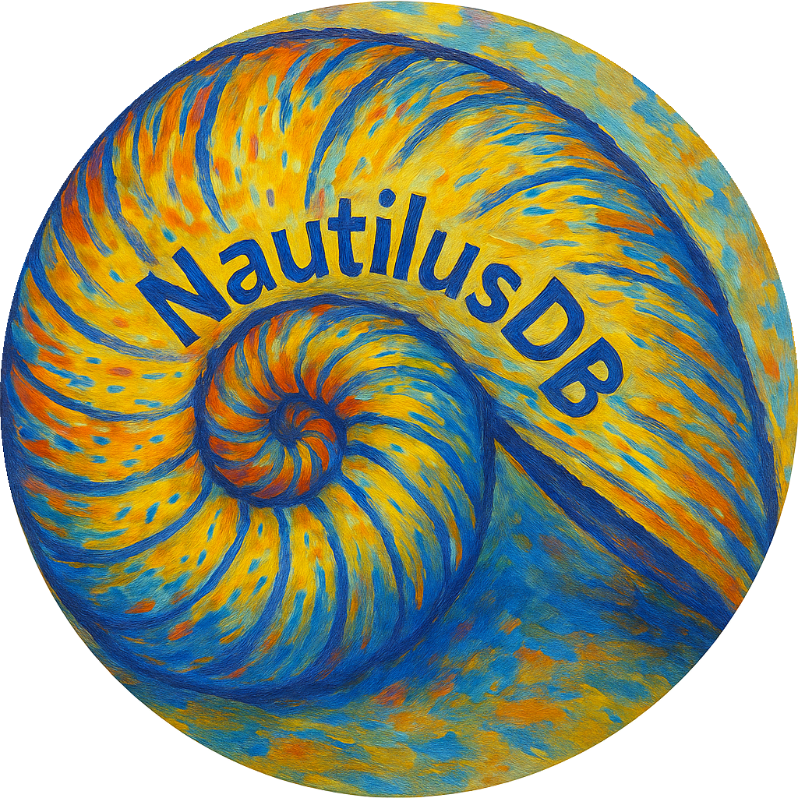

    

<blockquote style="font-style: italic; font-family: 'Georgia', serif;">
  If you want to build a ship, don't drum up people to collect wood and don't assign them tasks and work, but rather teach them to long for the endless immensity of the seas.
    
                                    — Antoine de Saint-Exupéry
</blockquote>

## What is NautilusDB?

NautilusDB is a micro database engine designed for local use, with a focus on simplicity, transparency, and user control.

Given the wide array of local databases already available, it’s reasonable to ask: *Why create another one?*

The motivation behind NautilusDB is both practical and personal. I often find myself needing to store and retrieve information that’s not frequently accessed—details that, when required, are either forgotten or lost in an unclear storage location. Additionally, some of the data I need to store contains personal or sensitive details. While existing solutions could serve this purpose, I wanted a system that I could fully understand, audit, and trust.

As an engineer, the idea of building a minimal, self-contained database felt like a worthwhile challenge—an opportunity that allowed me to explore core software engineering concepts while also developing something that can have a proper practical use. 

So I started building NautilusDB—a simple, transparent, and self-contained database. 

